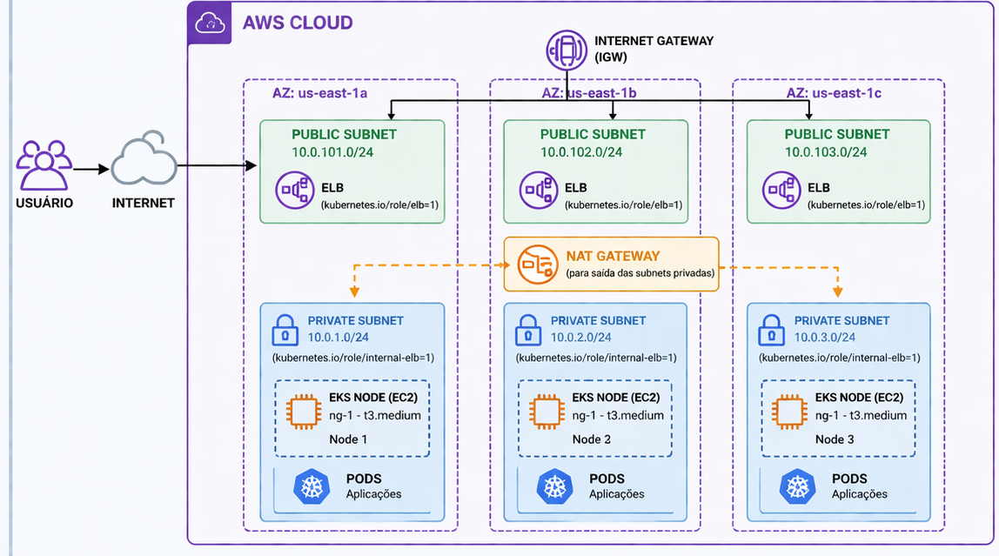

# AWS Infrastructure with Terraform (VPC & EKS)

Este projeto utiliza o **Terraform** para provisionar uma infraestrutura completa na AWS, incluindo uma VPC e um cluster Kubernetes gerenciado (EKS).

Foi desenvolvido com o objetivo de aprofundar conhecimentos em infraestrutura como código (IaC), utilizando Terraform para provisionamento de recursos na AWS, com foco em boas práticas de arquitetura em nuvem e orquestração de containers.

---

## Arquitetura do Projeto

A infraestrutura segue as melhores práticas de rede e computação na nuvem:



### Rede (VPC)
- **VPC (Virtual Private Cloud)**: Rede virtual isolada com CIDR `10.0.0.0/16`.
- **Subnets**: Subdivisão lógica em 3 zonas de disponibilidade (`us-east-1a`, `us-east-1b`, `us-east-1c`).
  - **Públicas**: 3 subnets para recursos com acesso direto (ex: Load Balancers).
  - **Privadas**: 3 subnets para recursos protegidos (ex: Nodes do Kubernetes).
- **NAT Gateway**: Permite que os nós do EKS acessem a internet para atualizações sem exposição direta.
- **VPN Gateway**: Habilitado para futuras conexões seguras à VPC.

### Kubernetes (EKS)
- **Cluster EKS**: Versão `1.33`.
- **Managed Node Groups**: Grupo de instâncias `t3.medium` com auto-scaling (mín: 1, máx: 3, desejado: 3).
- **Endpoint Access**: Acesso público ao endpoint do cluster habilitado.

---

## Pré-requisitos

Antes de começar, você precisará instalar e configurar as seguintes ferramentas:

### AWS CLI
*Instalação e configuração conforme o padrão AWS. Certifique-se de executar `aws configure`.*

### Terraform
*Certifique-se de ter o Terraform instalado (`terraform -v`).*

### Kubectl
Necessário para interagir com o cluster EKS após o provisionamento.
- **Instalação (Ubuntu/Debian):**
  ```bash
  sudo apt-get update
  sudo apt-get install -y kubectl
  ```

---

## Como Utilizar

Siga os passos abaixo na ordem para gerenciar sua infraestrutura:

1. **Inicializar o ambiente**: `terraform init`
2. **Padronizar o código**: `terraform fmt`
3. **Validar a configuração**: `terraform validate`
4. **Planejar as mudanças**: `terraform plan`
5. **Aplicar a infraestrutura**: `terraform apply`

---

## Conceitos Fundamentais

### Infraestrutura como Código (IaC)
Declare sua infraestrutura de forma legível e versão o seu ambiente.

### Por que usar Terraform & EKS?
1. **Automação**: Elimina processos manuais na criação de clusters complexos.
2. **Escalabilidade**: EKS gerencia o Control Plane do Kubernetes, enquanto o Terraform gerencia o Data Plane (Nodes).
3. **Gerenciamento de Estado**: O Terraform mantém o controle do que já foi criado através do arquivo `terraform.tfstate`.

---

## Recursos Adicionais

Para facilitar o estudo e tirar dúvidas sobre os conceitos aplicados neste projeto, você pode consultar minhas anotações pessoais no Notion:

- [Anotações de Estudos - Terraform](https://www.notion.so/Terraform-33b6a62fe40e804da35ec9080efe3a34?source=copy_link)

---

## Créditos e Agradecimentos

Este projeto foi desenvolvido com base no conteúdo e ensinamentos de **Fabricio Veronez**.